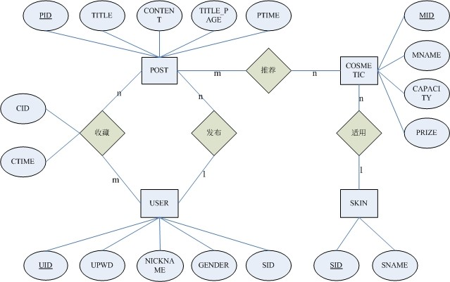
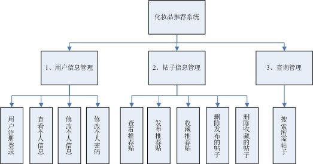
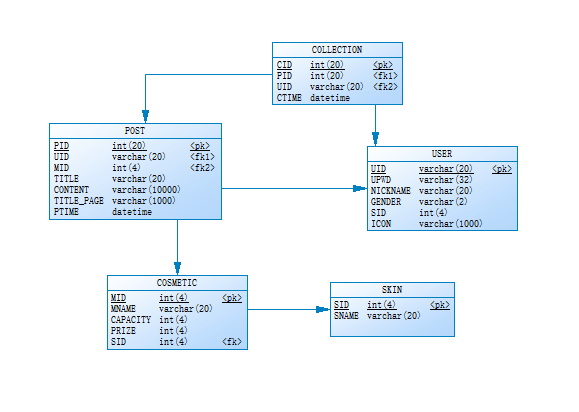
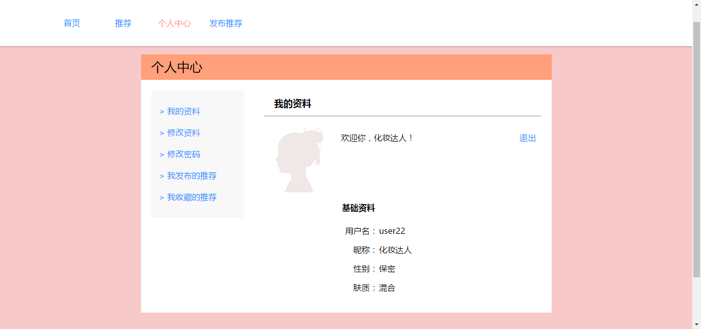
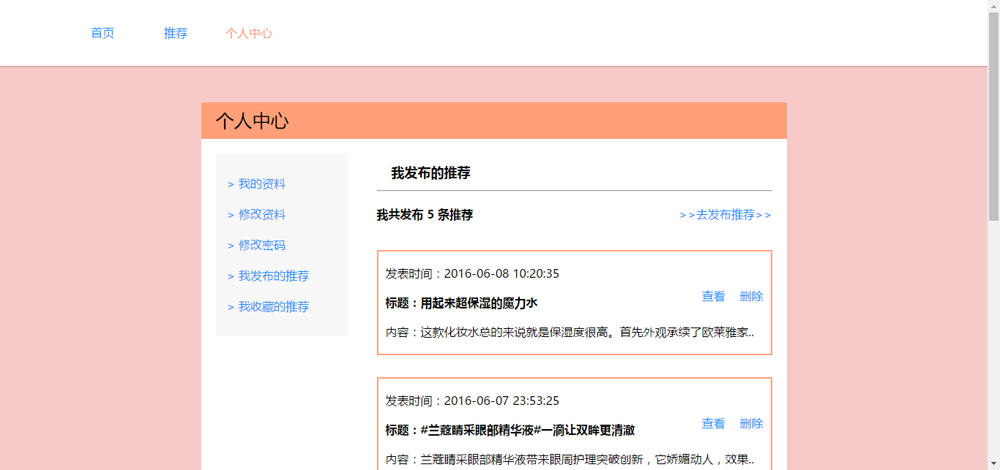
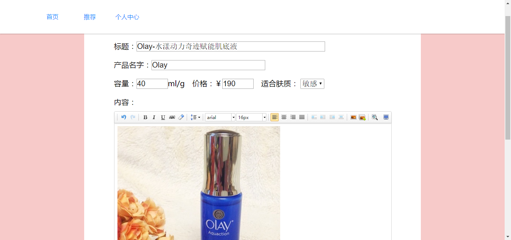
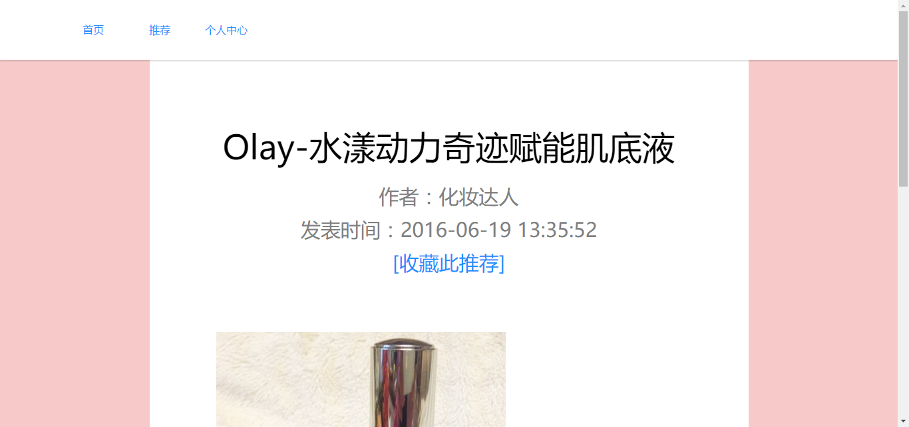
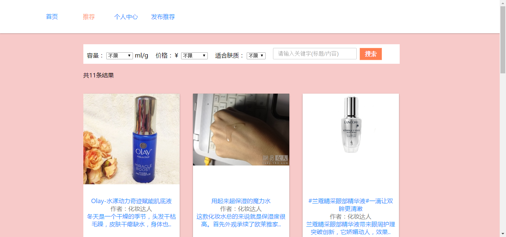

# LittleRedHat
a database task--a website that recommends cosmetics

这是我的数据库系统课程的大作业，废时七天独立开发完成，算是初步接触了整个网站的搭建开发，因为时间和精力不足，所以有些功能尚未完善，技术也不是很成熟。

 
<strong>其中用到的技术：</strong>

前端：html,css,js,jquery,ajax

后端：php

数据库：MySQL

环境：wampserver

 
<strong>网站的功能：</strong>

1、化妆品推荐贴搜索功能：根据化妆品的信息及用户的肤质来搜索用户需要的化妆品推荐帖子。

2、收藏功能：用户可以收藏喜欢的化妆品推荐贴。

3、发布功能：用户可以发布帖子来推荐化妆品。

4、删除功能：用户可以删除自己发布的帖子，也可以取消对推荐贴的收藏。

5、修改功能：用户可以修改自己的信息。

6、用户注册功能。

7、用户登录功能。

 
<strong>架构：</strong>

E-R图：

模块：

流程：

数据表关系：

 
<strong>部分效果图：</strong>

